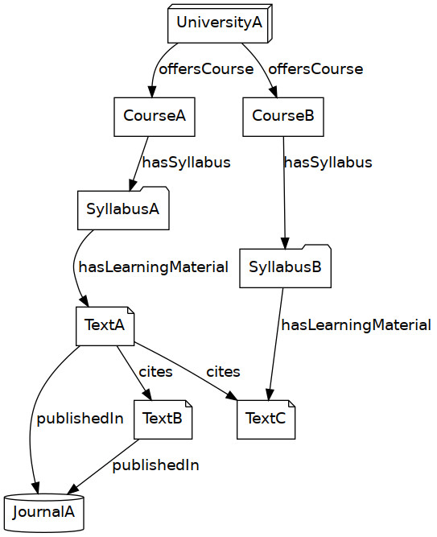
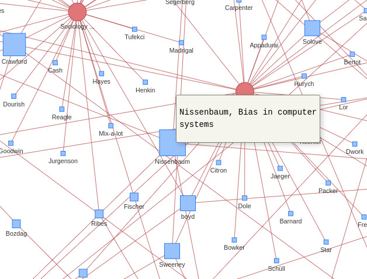

# Structured Abstract

**Purpose**: As data-driven tools increasingly shape our life and tech ethics crises become strikingly frequent, data ethics coursework is urgently needed. We map the field of data ethics curricula, tracking relations between courses, instructors, texts, and writers, and present a proof-of-concept interactive website for exploring these relations. Our method is designed to be used in curricular research and development and provides multiple vantage points on this multidisciplinary field.

**Design/methodology/approach**: We utilize data science methods to foster insights about the field of data ethics education and literature. We present a semantic, linked open data graph in the Resource Description Framework (RDF), along with proof-of-concept analyses and an exploratory website. Its framework is open-source, and language-agnostic, providing the seed for future contributions of code, syllabi, and resources from the global data ethics community.

**Research limitations/implications**: The syllabi we have collected are self-selected and represent only a subset of the field. Furthermore, our method exclusively represents a course’s assigned literature rather than a holistic view of what courses teach. We present a prototype rather than a finished product.

**Findings**: Our method provides a convenient means of exploring an overview of the field of data ethics' social and textual relations. For educators designing or refining a course, we provide a method for curricular introspection and discovery of transdisciplinary curricula.

**Originality**: Our curricular survey provides a new way of modeling a field of study, using existing ontologies to organize graph data into a comprehensible overview. Our framework may be repurposed to map the institutional knowledge structures of other disciplines, as well.

# Keywords

Data ethics education, data justice, AI ethics, tech ethics, pedagogical research, education research, transdisciplinary education, semantic web, data visualization

# Introduction

From the spread of disinformation via social media, to class-biased dynamic pricing, to racial profiling in online systems that lead to real-world harms, teaching data ethics has never been more urgently needed.  Data ethics is a burgeoning field, an interdisciplinary area of study and education that spans computer science, data science, statistics, the social sciences, and the humanities. Thankfully, there is growing recognition of the importance of data ethics as a foundational topic within education in data-driven fields.

Our initial goal was to design a course in data ethics. To achieve this, we needed an overview of the field, in terms of its core texts and themes that are being taught. As data scientists ourselves, we wanted to approach these questions systematically. We therefore took a data-driven approach to the problem of curricular design, generating a method which we could then share with other data ethics educators. Furthermore, since our methodology can be applied widely to the survey of any discipline, we open source our work, in the hopes that it can be used to map other disciplines. Fundamentally, we are providing a methodology for curricular introspection.

The products of our research, are several. First, we provide a data set which describes a scholarly and pedagogical network. Next, we present a proof-of-concept interactive website for exploring that data. We then share [an example syllabus informed by our findings](http://data-ethics.jonreeve.com/). Finally, we provide a template for a semantic, machine-readable course syllabus website, so that others can easily produce a syllabus using the same methods. All of this is available via our project's website, <https://data-ethics.tech>.

Our initial motivations were to collect data on the state of data ethics, in order to help others or ourselves answer broad questions, such as: 

 - Which texts are most frequently assigned, and cited? And which texts are excluded? Are there important outliers that deserve more attention?
 - Where are the disciplinary divides, and how can they be bridged?
 - What are similarities and differences between data ethics courses?
 - Which institutions, scholars, educators are innovating in this space? 
 - What are the major topic areas?

To explore these questions, and to give others the opportunity to explore them as well, we aggregated hundreds of syllabi, and hundreds of published papers, as well as adjacent and auxiliary data. Syllabi we scrape from university and instructor websites; bibliographic data from CrossRef and Semantic Scholar; researcher biographies from ORCID, and geographic data from Wikidata. We then integrated this data into a large graph database, using the semantic web language known as the Resource Description Framework (RDF). 

The proof-of-concept website includes three interfaces: 1) a uni-course visualization that links data ethics courses with their institutional homes; 2) a course-text visualization that showcases the assigned literature from each course, and 3) a third “text-text” visualization, still in development, which will highlight citation relationships between assigned texts and the wider data ethics field. Our data and framework are open-source, and anyone can add new features, interfaces, and new data, such as adding additional syllabi to the repository or texts to the bibliography.

Our method is designed to provide multiple entry points into this transdisciplinary field beyond one’s own area of primary expertise. However, we acknowledge that by relying on data science methods and limiting our scope to the assigned literature in syllabi, our method does not capture a holistic view of what is taught in each course. For example, the constructivist learning dynamics in any given classroom or cohort, including lectures, discussions, written responses to readings, project-based learning, and peer-to-peer instruction, all fall outside the scope of our mapping of data ethics coursework. Despite our projects' limitations, we hope our method will serve as a stepping stone towards transdisciplinary exploration, imagination, collaboration, and new courses that enrich the field. 

# Background and Related Works

This project builds upon the work of a number of scholars who have sought to define and improve the field of data ethics education. Note that for the purposes of our analysis, we use the term “data ethics” as an umbrella term that encompasses the fields of AI ethics, tech ethics, data justice, and other overlapping subject areas aimed at improving technologists’ ethical foundations and delivering equitable impacts from data-driven practices. Given that data exists prior to its analysis and is not limited to a particular constellation of technologies, we consider "data ethics" as a bridge between these related fields. While this paper will not delve into the subtle overlaps and important distinctions between these unique fields of research and education, we acknowledge these distinctions and suggest the following literature for further insight [@fieslerWhatWeTeach2020; @haoStopTalkingAI2021; @metcalfPedagogicalApproachesData2015; @nkondeMutaleNkondeAI2021; @ochigameInventionEthicalAI2019; @rajiYouCanSit2021; @sloaneInequalityNameGame2019a; @taylorWhatDataJustice2017; @thomasConversationTechEthics2019; @zeffiroDataEthicsData2021]. 

In 2017, spurred by a New York Times article that argued that academics are “asleep at the wheel” when it comes to tech ethics [@oneilOpinionIvoryTower2017], Casey Fiesler crowdsourced a list of close to 200 tech ethics syllabi being taught primarily in the U.S [@fieslerTechEthicsCurricula2019]. This collection depicted the outline of a nascent field of education. This repository in its raw form was credited with helping many educators design or refine a syllabus, as well as construct compelling arguments for the value of launching a tech ethics course at their institution [@fieslerTechEthicsCurricula2019]. It also sparked several analyses to understand the contours and blindspots of this emerging field.

Fiesler, along with co-authors Natalie Garrett and Nathan Beard, used metadata from 202 of these courses to analyze “What Do We Teach When We Teach Tech Ethics” (2020). First, they explored the disciplinary spread of these classes in terms of a course’s home department, the instructor’s home department, and the instructor’s terminal degree. Computer Science was the most common departmental home both for courses and instructors, while Philosophy was the most common terminal degree among instructors. Next, they looked at major topic areas covered in these courses, the most common being Law & Policy, addressed in 57% of courses, and the least common being Medical/Health, addressed in less than 10% of courses. Finally, they assessed the most common learning outcomes promised students in these courses, including “critique,” “see multiple perspectives,” and “create solutions.”

Their analysis showed great variability across content taught, which they suggest is not surprising considering the lack of standards in the field and its transdisciplinary nature [@fieslerWhatWeTeach2020]. They suggest that this variability is positive; it represents an opportunity for educators to learn from one another's disciplinary expertise and teaching approaches. Despite variability, their analysis reveals key concepts considered critical in tech ethics, including algorithms, privacy, and inequality/justice. They also share a call to action to expand the field of tech ethics education. In particular, they highlight the need to develop approaches to fully integrate ethics into technical content for computer science (CS) students, especially at the initial stages of their education, when students are most impressionable [@fieslerWhatWeTeach2020].

Our work builds upon Fiesler et al.’s work in several ways. First, our graph draws on the open-source syllabi shared in Fiesler’s repository [@fieslerTechEthicsCurriculum2017], among other syllabi shared on the web. Second, we respond to the calls to action embedded within Fiesler et al’s analysis, namely to foster conversation among educators and bridge disciplinary divides. Third, our own resulting course design couples ethical reflection with computational practice and solution-building.

Our work also draws on the analysis of these syllabi by Inioluwa Deborah Raji, Morgan Klaus Scheuerman, and Razvan Amironesei in their 2021 FAccT conference paper, “You Can’t Sit With Us: Exclusionary Pedagogy in AI Ethics Education.” Their analysis surfaces patterns of what the authors call “exclusionary pedagogy” in AI ethics. The authors argue that the predominance of computer scientists as instructors of these courses, hierarchies of knowledge that elevate CS and other quantitative fields above the humanistic social sciences (HSS), and the siloing of the field from HSS perspectives, all promote techno-solutionism and the myth of technologists as “ethical unicorns” [@rajiYouCanSit2021]. They propose that tech ethics challenges are inherently interdisciplinary; therefore, education in this field must in turn include deep transdisciplinary collaboration and propose systemic rather than individualistic solutions.

Raji et al. argue that current gaps in transdisciplinary collaboration in AI Ethics can be perceived through the lack of transdisciplinary research output and siloed citations. This translates into the classroom vis-a-vis the assigning of literature with siloed citations. It is also reflected in the fact that only 2% of the 254 syllabi in their analysis allowed for “cross-disciplinary teaching or open courses with non-prohibitive requirements,” both of which would encourage and enable students from different disciplines to enroll in a data ethics course together, thus sparking transdisciplinary discussion and insight [@rajiYouCanSit2021].

In terms of our communal aspirations in the field of data ethics, this is important on two fronts. First, courses that bridge disciplines and do not require pre-existing technical proficiency have the potential to attract new cohorts of students to engage with computational fields [@zauggCollaboratoryColumbiaAspen2021]. It is important to bring students with ethical insights from other disciplinary backgrounds into the field of computation, and transdisciplinary data ethics coursework facilitate that. Second, by using data ethics as a bridge to open a new pathway into computational fields, there may be a potential to attract students from under-represented backgrounds who might otherwise hesitate to take foundational computational coursework because they don’t see themselves represented in the field.

Both potential “pipeline” outcomes hold the promise to help address the calls data ethicists have made regarding the need to diversify the computational workforce in terms of disciplinary expertise, demographics, and lived experience [@lueDataScienceFoundation2019; @themoore-sloandatascienceenvironments:newyorkuniversityucberkeleyandtheuniversityofwashingtonCreatingInstitutionalChange2018; @rawlings-gossKeepingDataScience2018; @westDiscriminatingSystemsGender2019]. While we can only speculate about the profiles of individual students taking these courses as well as the long-term outcomes of their learning, we hope this project will provide one small stepping stone towards further analysis and imagination of how data ethics education is (or could be) embedded within the disciplinary structures of universities, and the degree to which courses provide entrée into computational practice for students rooted in other disciplines.

Importantly, Raji et al. (2021) also highlight the need for courses to include student engagement with stakeholders from outside academia who are typically the most impacted by algorithmic harms. While this type of curricular approach largely escapes our scope, which is limited by its primary focus on assigned literature, this key aspiration in data ethics education is essential to highlight in the context of this paper.

Responding to these varied calls to action in the field of data ethics education, we aim for our text-to-text view, which maps citation patterns, to visually highlight the issue of siloed citations and inspire cross-disciplinary collaboration. We also hope our website’s accessible interface will spur exploration of material across disciplinary divides. In our own case, our syllabus design builds off of our varied expertise in the humanistic social sciences, statistics, and data science, and will be co-taught without computational prerequisites to encourage a disciplinarily-diverse cohort of students.

We also note the 2015 “Pedagogical Approaches to Data Ethics” report by Jacob Metcalf, Kate Crawford, and Emily Keller at the Data & Society Research Institute. Based on their survey of existing data ethics courses, and informed by research on best practices in science and engineering ethics education, they propose that the following four approaches to data ethics education should be encouraged:

>1) Integrative approaches are preferable to stand-alone modules...
>2) When possible, integration with design/practical work should be encouraged. Ethics should be associated with problem-solving, not just rule-following or prevention of harm.
>3) The micro-ethics of research should be intellectually and practically associated with broader social goods. Neither the RCR [Responsible Conduct of Research] approach nor broad social goods alone are adequate.
>4) Culture, collective responsibility, and collaboration are critical components of successful research ethics education. [@metcalfPedagogicalApproachesData2015, p. 3]

We developed our method with the intention of facilitating further analysis, imagination, and innovation to strengthen the field of data ethics education. Providing our database and website as a starting point, we suggest further research questions for the future, that draw on the insights and aspirations for the field shared by the scholars above. Research questions ripe for investigation include:

 - What patterns in data ethics education can we deduce from looking at similarities and differences between courses offered at different universities?
 - What are major topic areas in data ethics courses? Do they map onto particular approaches to promote ethical data science such as FAccT?
 - How many data ethics courses help students make the leap from “critique” to computational problem-solving?
 - How many courses are fostering cross-disciplinary collaboration?
 - How many courses include community stakeholder engagement?
 - How many courses are linking micro-ethics with an exploration of data scientists’ collective responsibility for the broader social good
 - How might our "roadmap" be useful for educators designing data ethics courses? What are its limitations (reducing a course to its assigned texts, for example) and how might they be addressed through complementary efforts?

# Methods

We begin with syllabi crowdsourced from Fiesler et al.’s study, which today collects roughly three hundred syllabi in tech ethics [@fieslerTechEthicsCurricula2019]. Expanding our scope beyond just tech ethics, we adopt the umbrella subject area of data ethics, and augment our collection of syllabi with those gathered from the Open Syllabus Project [@nowogrodzki2016mining], the AI Ethics Workshop [@ai_ethics], and elsewhere. These syllabi we then download, mine for their assigned texts, and add to our graph database. 

We note that the syllabi from these sources are largely self-selected or curated, and represent only a subset of the field. Therefore, we cannot claim to represent the field as a whole, or even a random sample of it. While projects such as the Open Syllabus Project are breadth-first, with ambitions to parse all syllabi on the Internet, ours is depth-first, exploring many facets of a single field. Furthermore, the graph we utilize is language-agnostic, and therefore our repository is able to incorporate syllabi and resources in other languages, and we particularly invite expansion in terms of mapping data ethics coursework and literature in languages beyond English. Our project is also distinct in that our ethical framework commits us to open-sourcing our work for the benefit of the wider field. We release all materials under the GNU General Public License, Version 3, a strong copyleft license. 

Since the RDF technology we use prefers universal reference identifiers (URIs), we attempt to resolve our data to stable identifiers, wherever possible, using new data from a number of public databases. We resolve scholarly papers to digital object identifiers (DOIs), using metadata APIs such as those of [CrossRef](https://www.crossref.org/) and [Semantic Scholar](https://www.semanticscholar.org/), which we also use to enhance our available bibliographic metadata. We resolve books to stable identifiers by querying the [Google Books](https://books.google.com/) and [Open Library](https://openlibrary.org/) APIs. We resolve researchers and writers to their [ORCIDs](https://orcid.org/), where possible. Finally, we resolve university names to their websites and Wikidata entries.

Each of these additional data sources provides a number of advantages, beyond simply the resolution or deduplication of their entities in our database. Semantic Scholar, for instance, maintains data about the citation and reference network of a given paper. Open Library maintains information about the number of editions a given book has seen, worldwide. ORCID allows us to find the other publications by a given researcher, as well as demographic information about them. Wikidata provides us with geographic information about universities, which we may later use to plot these courses on a world map.

We then represent the resulting data, and its relations, as a series of subject-verb-object triples, in the Turtle syntax of the RDF. This graphical data structure is the next-generation language for representing structured data on the web. It is highly machine-readable and may become "Web 3.0," a web of structured knowledge.

An example might look like this, as portrayed here in pseudo-RDF: 

```
<Course A> <is offered by> <Department A>
           <has a syllabus at> <https://example.edu/syllabus>
           <is taught by> <Instructor M>
           <is required by> <Department A>
           <has learning material> <Text A>

<Text A> <was written by> <Scholar A>
         <cites> <Text B> 
         <is cited by> <Text C> 

<Instructor A> <wrote> <Text B>
               <wrote> <Text C>
               <taught> <Course B>
               <has ORCID> <Orcid ID A>

<Department A> <is a department of> <University A>
               <has website> <http://department.example.edu>

<University A> <has latitude> <34.000>
               <has longitude> <37.000>
               <was founded> <1899>
        ...
```


[@Fig:chart] shows an example directed graph visualization of this structure, illustrating relations between these entities.

{#fig:chart}

In practice, however, each of these tokens must have a stable URI—even the verbs. Thus, we employ a number of pe-existing ontologies, or pre-defined sets of relations, to describe these relationships in a structured way. The Curriculum Course Syllabus Ontology (CCSO) describes relations between courses, universities, syllabi, professors, and learning materials such as texts [@katis_2018]; the Bibliographic Ontology (Bibliontology) describes metadata for articles, books, videos, and other media [@pertsas_2017]; and the Citation Typing Ontology (CiTO) describes citation relations between texts [@peroni2012]. We integrate these three, along with a few standard ontologies for defining people and things, such as the Friend-of-a-Friend (FOAF) ontology, and those used by Wikidata. For those entities which aren't resolvable to standard URIs, we provide one. This is the case, for example, for courses, which have URIs like <https://data-ethics.tech/course/1>. 

To make sense of these connections, we build a number of force-directed network visualizations in JavaScript, so that they may be explored by a wider public. This website has three main visualizations: university-course, course-text, and text-text. University-course represents universities and their courses as nodes, with edges that show which universities offer which courses. Course-text represents courses and the texts that they assign. And text-text represents those texts, and their citation/reference network. For each of these, we compute basic network statistics such as page rank, which allow users to see at a glance which texts are the most assigned, and which universities are best represented in our dataset. 

We are also building a [mechanism for users to submit their own existing data ethics syllabi to our database](https://data-ethics.tech/submit); this way, our database will always stay up to date. This framework can be adapted by anyone interested in mapping an academic discipline, given a list of courses and their syllabus URLs.

The process of parsing syllabi—traditional documents, usually in PDF or DOCX format—into structured, machine-readable data is a difficult, complex one. Therefore we imagined and prototyped modern course syllabi, which would not only be web-ready, but semantically structured and machine-readable from the start. Towards this end, we provide [a proof-of-concept syllabus template](https://github.com/JonathanReeve/template-course-website), so that instructors may create a course website which already organizes course data in a structured way. The syllabus is marked up such that it may be automatically added to our database and the semantic web at large. In this manner, instructors can easily create a course syllabus website, while contributing to disciplinary metacognition.

Instructors need only fork the template repository, fill out basic course information, and provide a BibLaTeX file with assigned readings and their dates. The provided build script will format the bibliography for each of the readings, add them to a machine-readable semantic graph, and generate a course syllabus and website, in a standards-compliant format. The website is built using GitHub Actions, and hosted free of charge on GitHub Pages. This process not only makes it much easier for course instructors to create syllabi, but automatically generates a course website for them, publishes it, and ensures that the underlying data is available to curriculum research projects such as ours. By making syllabi machine readable, it will be easier for researchers or fellow educators to map fields of education in order to expand or improve them, which we expect will become a common practice in the future.

# Contributions

Our methods contribute to data ethics education by providing a means for curricular introspection. For educators designing or refining a course, our visualization provides an overview of the courses that are already being taught. This provides an opportunity for educators to more easily imagine expansions of their syllabi beyond their expertise, and to pursue top aspirations in the field, such as teaching data ethics in a transdisciplinary manner, embedding computational problem-solving into coursework, and highlighting the perspectives of scholars from diverse backgrounds.

While patterns in data ethics education emerge organically from the data, we also intervene manually to identify and label some of these patterns. Patterns of possible interest to educators include clusters of courses at institutions and the most-assigned literature in the field. In the future we plan a visualization that foregrounds patterns in citations as well as clustered topic modeling of core subject areas in the data ethics literature.

{#fig:graph}

Our data visualization allows one to quickly identify valuable patterns in texts assigned, including outliers. [@Fig:graph] shows a portion of our course-text graph, showing the most-assigned text our analysis identified: Friedman and Nissenbaum's 1996 paper "Bias in Computer Systems" [@nissenbaum1996]. When viewed as a text-text network, however, the rankings are very different: McLuhan's 1964 _Understanding Media_ is the most-cited node in our network [@mcluhan1994understanding]. It makes sense that McLuhan's book is so widely cited, for instance, since its total count is an accumulation of its nearly 60 years of publication. We must treat these types of rankings with skepticism, however, since they represent a dataset that is still very incomplete, and a node resolution process that is still under development.

However, rather than merely generating rankings of texts, and statistics about courses, we are more interested in creating a proof-of-concept system for exploration of a field, one which can be built upon by future researchers. This type of mapping may help to bridge the gap between practical and theoretical factions in the field of data ethics, digital humanities, or other fields that are in the process of defining or redefining themselves.

Our network visualizations enable user engagement with both consensus and outliers. Bringing outliers to the fore is important considering that racial justice scholarship, feminist theory, and efforts to decolonize curricula have highlighted how the process by which texts enter the canon is not always meritocratic and often outsider voices deserve to be centered. This is all the more true in a field such as data ethics where critical voices are challenging established perspectives, practices, and institutions. 

Imagine you're creating a data ethics syllabus and you're thinking about what to assign. You can find several texts in our graph and see at a glance the citational network that surrounds it and get an idea of the research cluster, which could help you create a module. If you are looking to decolonize your syllabus, you might choose to assign, from within a cluster, the work of a scholar from an under-represented community and/or work that addresses under-studied topics. You can also see at a glance where other courses are being taught, such as courses that are thematically similar but geographically distant. Some educators may use the tool to "copy" others, opting for the most mainstream approach to teaching a topic, thus streamlining the syllabus development process. But other educators may use the tool to explore the field and look for ways to diverge from pre-existing approaches, helping to break out of filter bubbles that at times encapsulate areas of research at clusters of similar institutions. 

For example, an instructor designing a course in data ethics might follow this procedure in drafting a syllabus: 

1. Supply seed data related to a course-in-development: an instructor's name, the university, and several readings to be assigned
2. Observe the existing graphical connections of these seed nodes: other courses taught at the same university, if not already known; other courses teaching the same texts; and other texts assigned by those courses
3. Augment the course-in-development with new texts and approaches from (2), *as well as texts from distant or disconnected fields*. Go to (1) and repeat, until the course design is finished. 

This is currently only possible to a limited degree, given the scope of our proof-of-concept website. We then must conclude with calls for further research: either contributions to our project directly ([all of our code and data is open-source and available on GitHub](https://github.com/JonathanReeve/data-ethics-literature-review)), or projects which can employ our data or methods to new ends. 

# Conclusion

Working in a multidisciplinary and quickly growing field, data ethics educators can benefit from a birds-eye view of curricular practice and real-time innovation. Our database and website provide a starting point for this exploration and analysis. Our literature review provides an overview of the foundational aspirations of the field, which educators may wish to manifest within their course design. Top aspirations of the field include embedding ethics within computational problem-solving, offering multi-disciplinary courses without technical prerequisites as an entry point into the field for disciplinary and demographically diverse students, and embedding opportunities for students to engage with stakeholders of data-driven practices outside the halls of academia and the field of tech.

Our own course, "[People vs. Algorithms: Data Ethics in the 21st Century,](http://data-ethics.jonreeve.com/)" is informed by everything we learned from this project. While a minority of data ethics courses include practical components and work on solutions/pathways for mitigating ethical issues, our course includes practical exercises in ethical problem-solving. Teaching cross-disciplinarily between Stats, CS, humanities, and social sciences, we have opened our course to a mixed classroom with no technical prerequisites. We are engaging with literature across many fields, teaching foundational computational skills and problem-solving alongside reading and writing assignments that engage with some of the most-cited thought pieces as well as important outliers. We push students beyond identifying ethical issues to identify new horizons of possible solutions. As we pilot and reiterate our course, we look forward to utilizing the website we developed as a means to consider new perspectives and approaches in the field of data ethics education.

Most importantly, we hope that other educators benefit from this method and proof-of-concept website. As data ethicists ourselves, we care about openness and transparency, and so [we have open-sourced this data](https://github.com/JonathanReeve/data-ethics-literature-review), so that other researchers can use our work to answer their own questions. We hope that our framework may also be used to help map the institutional knowledge structures of even more disciplines.

# References

<!-- This section will be auto-generated. No need to put anything here manually. -->
